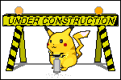
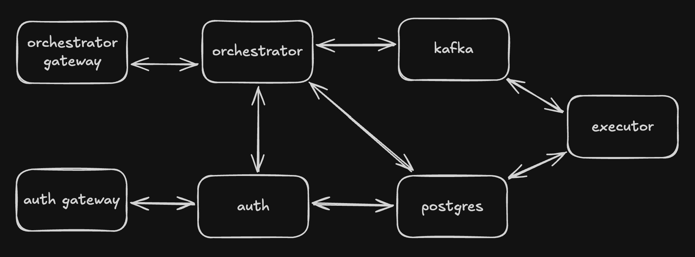
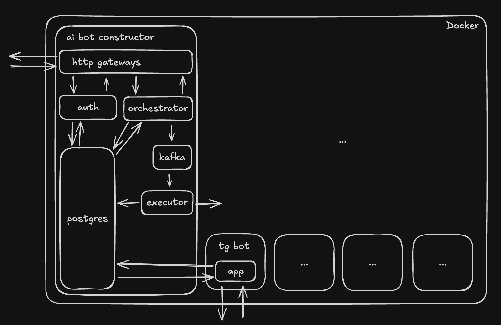

  
  <h1>AI Bot Constructor</h1>
  
Platform for deploying personalized AI bots on Telegram

  

## About
This is a microservice system that allows users to quickly create and run their own neural network-based Telegram bots without the need to manage infrastructure.

## Stack
grpc
postgres
kafka
docker sdk
telegram bot api

## Architecture

## Roadmap
[x] Auth service
[x] Auth gateway
[ ] Orchestrator service
[ ] Orchestrator gateway
[ ] Bot container
[ ] Executor service
